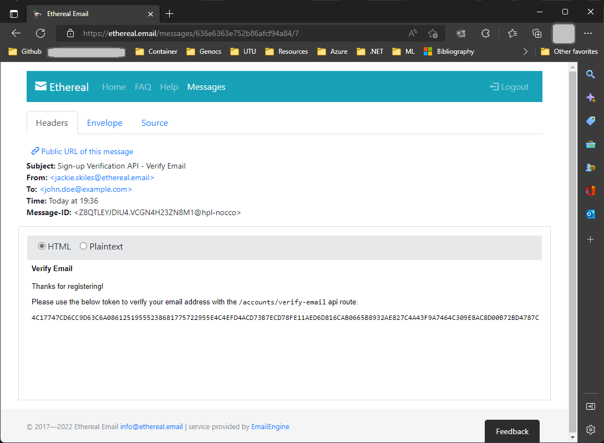

# .NET 7 Signup & Verification Service

.NET 7.0 - API to Sign Up with Email and mobile Verification, Authentication & Forgot Password.

The inspiration come from:

Documentation at: [jasonwatmore](https://jasonwatmore.com/post/2022/02/26/net-6-boilerplate-api-tutorial-with-email-sign-up-verification-authentication-forgot-password)


Documentación en [jasonwatmore-español](https://jasonwatmore.es/post/2022/02/26/net-6-tutorial-de-api-estandar-con-registro-de-correo-electronico-verificacion-autenticacion-y-contrasena-olvidada)


### Install dotnet ef tools

The .NET Entity Framework Core tools (dotnet ef) are used to generate EF Core migrations.

To install the EF Core tools globally run:
``` PS
dotnet tool install -g dotnet-ef
``` 
, or to update run
 
``` PS
dotnet tool update -g dotnet-ef
```

To enable database migration
``` PS
cd Genocs.Auth.DataSqlLite

# In case of SQL server, comment the line above and remove the 
# comment below

# cd Genocs.Auth.DataSqlServer

dotnet ef migrations add InitialCreate
```

### Email Verification

You can use fake Email Verification by using: [ethereal](https://ethereal.email/)




### Mobile Verification

You can use Mobile Verification by using: [twilio](https://www.twilio.com/)


In order to do that a valid Twilio account is required.


Following the twilio appsetting to setup the Mobile Verification.

SmsServiceId is the twilio Verification Service Id

``` PS
  "AppSettings": {
    "SmsAccountSid": "<<your Twilio account SID>>",
    "SmsAuthToken": "<<your Twilio auth Token>>",
    "SmsServiceId": "<<your Twilio Service Id>>"
  }
```


# Build Run and Test

``` bash
# Build
scripts/build.sh

# To run the solution
scripts/start.sh


# To run the solution tests
scripts/test.sh
```